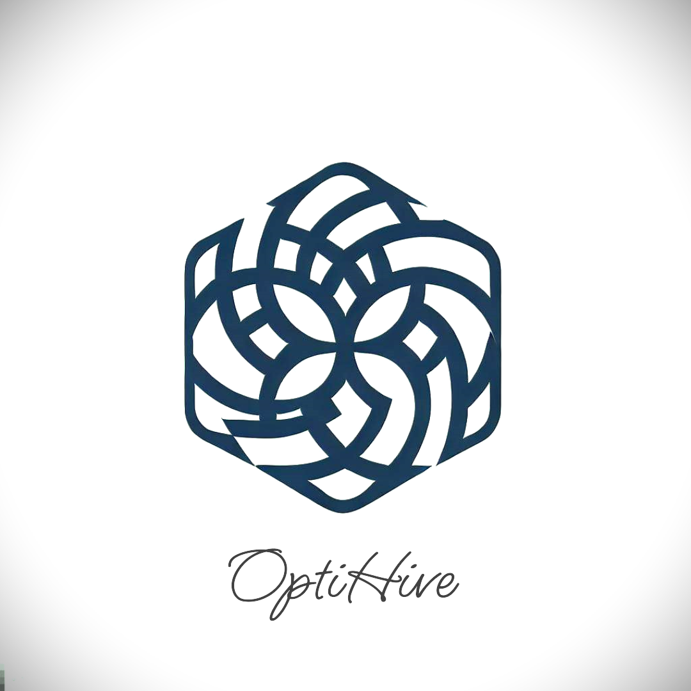

<!-- Improved compatibility of back to top link: See: https://github.com/othneildrew/Best-README-Template/pull/73 -->
<a name="readme-top"></a>

<!-- PROJECT SHIELDS -->
<!--
*** I'm using markdown "reference style" links for readability.
*** Reference links are enclosed in brackets [ ] instead of parentheses ( ).
*** See the bottom of this document for the declaration of the reference variables
*** for contributors-url, forks-url, etc. This is an optional, concise syntax you may use.
*** https://www.markdownguide.org/basic-syntax/#reference-style-links
-->
[![Contributors][contributors-shield]][contributors-url]
[![Forks][forks-shield]][forks-url]
[![Stargazers][stars-shield]][stars-url]
[![Issues][issues-shield]][issues-url]
[![MIT License][license-shield]][license-url]
[![LinkedIn][linkedin-shield]][linkedin-url]


<!-- PROJECT LOGO -->
<br />
<div align="center">
  <a href="https://github.com/adityaprakash-work/OptiHive">
    
  </a>

<h3 align="center">OptiHive</h3>

  <p align="center">
    A python package for biomimetic optimization algorithms.
    <br />
    <a href="https://github.com/adityaprakash-work/OptiHive"><strong>Explore the docs »</strong></a>
    <br />
    <br />
    <a href="https://github.com/adityaprakash-work/OptiHive">View Demo</a>
    ·
    <a href="https://github.com/adityaprakash-work/OptiHive/issues">Report Bug</a>
    ·
    <a href="https://github.com/adityaprakash-work/OptiHive/issues">Request Feature</a>
  </p>
</div>


<!-- TABLE OF CONTENTS -->
<details>
  <summary>Table of Contents</summary>
  <ol>
    <li>
      <a href="#about-the-project">About The Project</a>
      <ul>
        <li><a href="#built-with">Built With</a></li>
      </ul>
    </li>
    <li>
      <a href="#getting-started">Getting Started</a>
      <ul>
        <li><a href="#prerequisites">Prerequisites</a></li>
        <li><a href="#installation">Installation</a></li>
      </ul>
    </li>
    <li><a href="#usage">Usage</a></li>
    <li><a href="#roadmap">Roadmap</a></li>
    <li><a href="#contributing">Contributing</a></li>
    <li><a href="#license">License</a></li>
    <li><a href="#contact">Contact</a></li>
    <li><a href="#acknowledgments">Acknowledgments</a></li>
  </ol>
</details>


<!-- ABOUT THE PROJECT -->
## About The Project

[![OptiHive Screen Shot][product-screenshot]](product_screenshot)

This package features a collection of biomimetic optimization algorithms and heuristics like particle swarm optimization, ant colony optimization, firefly algorithm, cuckoo search, bat algorithm, etc. It is designed to be easy to use and implement in your own projects. It is also designed to be easily extensible, so that you can add your own algorithms and heuristics to the package.

<p align="right">(<a href="#readme-top">back to top</a>)</p>


### Built With

* [![Matplotlib][matplotlib-shield]][matplotlib-url]
* [![NumPy][numpy-shield]][numpy-url]
* [![scikit-learn][scikit-learn-shield]][scikit-learn-url]


<p align="right">(<a href="#readme-top">back to top</a>)</p>


<!-- GETTING STARTED -->
## Getting Started
### Installation

1. Clone the repo
   ```sh
   git clone https://github.com/adityaprakash-work/OptiHive.git
   ```
2. pip 
   ```python
   pip install git+https://github.com/adityaprakash-work/OptiHive.git
   ```

<p align="right">(<a href="#readme-top">back to top</a>)</p>


<!-- USAGE EXAMPLES -->
## Usage

### Common Imports
```python
import numpy as np

import matplotlib.pyplot as plt
import seaborn as sns

from optihive import pso as ohp
from optihive import utils as ohu
from optihive import benchmarks as ohb
from optihive import objectives as oho
```
### Objective Functions
```python
# Objectivefunction will be given a dictionary of parameters, with the keys
# being the parameter names and the values being the parameter values. 'f' here
# is a dummy that directly acts on x and y
f = lambda x, y: (x-3.14)**2 + (y-2.72)**2 + np.sin(3*x+1.41) + np.sin(4*y-1.73)

# 'of' however acts on the expected dictionary by unpacking it.
of = lambda kwargs: f(**kwargs)
print(f"of(1, 2) = {of({'x': 1, 'y': 2})}")
```
```
of(1, 2) = 4.130187303206262
```
### Using VanillaSwarm with a BenchmarkObjective
#### Defining the search space
```python
ss2d_htoof = {
    "x": ("con", bucof.bounds_2d[: 2]),
    "y": ("con", bucof.bounds_2d[2:]),	
}
```
#### Initializing BenchmarkObjective, VanillaSwarm and SwarmObjectiveTracker
```python
htoof = ohb.HolderTableObjective()

sot_hto = ohp.SwarmObjectiveTracker(
    track_params=["x", "y"],
    eager=False,
    lazy_step=2,
)

print("True loss Contour")
htoof.plot2d()
for use_grad in [False, True]:
    sot_hto = ohp.SwarmObjectiveTracker(
        track_params=["x", "y"],
        eager=False,
        lazy_step=2,
    )
    swarm_hto = ohp.VanillaSwarm(
        search_space=ss2d_htoof,
        n_particles=200,
        objective_function=htoof,
        cc=0.3,
        sc=0.3,
        r1=0.3,
        r2=0.3,
        use_gradient=use_grad,
        gw=0.1,
        n_perturb=2,
        r3=0.1,
        trackers=[sot_hto],
    )

    print(">>> Use Gradient: ", use_grad)
    print(">> Initial Values")
    print(f"swarm_hto | G: {swarm_hto.G}, Gs: {swarm_hto.Gs}")

    swarm_hto.run(500)

    print(">> Final Values")
    print(f"swarm_hto | G: {swarm_hto.G}, Gs: {swarm_hto.Gs}")
    print(f"htoof | G, Gs: {htoof.global_minima_2d}")
    sot_hto.draw_lazy(
        particle_indices=[p for p in range(0, swarm_hto.n_particles, 20)],
    )
```
```
True loss Contour
```
[![hot_obj][hot_obj]](hot_obj_png)
```
>>> Use Gradient:  False
>> Initial Values
swarm_hto | G: [[ 7.2977996 -9.677767 ]], Gs: -14.331993283198267
>> Final Values
swarm_hto | G: [[-7.909739 -9.306982]], Gs: -17.80278473486288
htoof | G, Gs: ((8.05502, 9.66459, -19.2085), (-8.05502, 9.66459, -19.2085), (8.05502, -9.66459, -19.2085), (-8.05502, -9.66459, -19.2085))
```
[![hot_obj_ugf][hot_obj_ugf_png]](hot_obj_ugf_png)
```
>>> Use Gradient:  True
>> Initial Values
swarm_hto | G: [[ 8.547695 -9.451452]], Gs: -16.3324676311381
>> Final Values
swarm_hto | G: [[-8.055022 -9.66459 ]], Gs: -19.20850256787143
htoof | G, Gs: ((8.05502, 9.66459, -19.2085), (-8.05502, 9.66459, -19.2085), (8.05502, -9.66459, -19.2085), (-8.05502, -9.66459, -19.2085))
```
[![hot_obj_ugt][hot_obj_ugt_png]](hot_obj_ugt_png)

_For more examples, please refer to the [Documentation](https://github.com/adityaprakash-work/OptiHive)_

<p align="right">(<a href="#readme-top">back to top</a>)</p>


<!-- ROADMAP -->
## Roadmap
See the [open issues](https://github.com/adityaprakash-work/OptiHive/issues) for a full list of proposed features (and known issues).

<p align="right">(<a href="#readme-top">back to top</a>)</p>


<!-- CONTRIBUTING -->
## Contributing

Contributions are what make the open source community such an amazing place to learn, inspire, and create. Any contributions you make are **greatly appreciated**.

If you have a suggestion that would make this better, please fork the repo and create a pull request. You can also simply open an issue with the tag "enhancement".
Don't forget to give the project a star! Thanks again!

1. Fork the Project
2. Create your Feature Branch (`git checkout -b feature/AmazingFeature`)
3. Commit your Changes (`git commit -m 'Add some AmazingFeature'`)
4. Push to the Branch (`git push main feature/AmazingFeature`)
5. Open a Pull Request

<p align="right">(<a href="#readme-top">back to top</a>)</p>


<!-- LICENSE -->
## License

Distributed under the MIT License. See `LICENSE` for more information.

<p align="right">(<a href="#readme-top">back to top</a>)</p>


<!-- CONTACT -->
## Contact

Aditya Prakash  
Twitter - [@adityaprakash_t](https://twitter.com/adityaprakash_t)  
Email - [adityaprakash.work@gmail.com](mailto:adityaprakash.work@gmail.com)


Project Link: [https://github.com/adityaprakash-work/OptiHive](https://github.com/adityaprakash-work/OptiHive)

<p align="right">(<a href="#readme-top">back to top</a>)</p>


<!-- ACKNOWLEDGMENTS -->
## Acknowledgments

* [Mathematical Modelling and Applications of Particle SwarmOptimization](ack1)
* [A New Discrete Particle Swarm Optimization Algorithm](ack2)

<p align="right">(<a href="#readme-top">back to top</a>)</p>


<!-- MARKDOWN LINKS & IMAGES -->
<!-- https://www.markdownguide.org/basic-syntax/#reference-style-links -->
[contributors-shield]: https://img.shields.io/github/contributors/adityaprakash-work/OptiHive.svg?style=for-the-badge
[contributors-url]: https://github.com/adityaprakash-work/OptiHive/graphs/contributors
[forks-shield]: https://img.shields.io/github/forks/adityaprakash-work/OptiHive.svg?style=for-the-badge
[forks-url]: https://github.com/adityaprakash-work/OptiHive/network/members
[stars-shield]: https://img.shields.io/github/stars/adityaprakash-work/OptiHive.svg?style=for-the-badge
[stars-url]: https://github.com/adityaprakash-work/OptiHive/stargazers
[issues-shield]: https://img.shields.io/github/issues/adityaprakash-work/OptiHive.svg?style=for-the-badge
[issues-url]: https://github.com/adityaprakash-work/OptiHive/issues
[license-shield]: https://img.shields.io/github/license/adityaprakash-work/OptiHive.svg?style=for-the-badge
[license-url]: https://github.com/adityaprakash-work/OptiHive/blob/main/LICENSE
[linkedin-shield]: https://img.shields.io/badge/-LinkedIn-black.svg?style=for-the-badge&logo=linkedin&colorB=555
[linkedin-url]: https://linkedin.com/in/aditya-prakash-work
[product-screenshot]: images/window_screenshot.png
[hot_obj]: images/hot_obj.png
[hot_obj_ugf_png]: images/hot_obj_ugf.png
[hot_obj_ugt_png]: images/hot_obj_ugt.png
[Matplotlib-shield]: https://img.shields.io/badge/Matplotlib-%23ffffff.svg?style=for-the-badge&logo=Matplotlib&logoColor=black
[Matplotlib-url]: https://matplotlib.org/
[NumPy-shield]: https://img.shields.io/badge/numpy-%23013243.svg?style=for-the-badge&logo=numpy&logoColor=white
[NumPy-url]: https://numpy.org/
[scikit-learn-shield]: https://img.shields.io/badge/scikit--learn-%23F7931E.svg?style=for-the-badge&logo=scikit-learn&logoColor=white
[scikit-learn-url]: https://scikit-learn.org/stable/

[ack1]: https://www.diva-portal.org/smash/get/diva2:829959/FULLTEXT01.pdf
[ack2]: https://www.cs.montana.edu/sheppard/pubs/gecco-2016a.pdf#:~:text=In%20this%20paper%2C%20we%20present%20a%20ver-sion%20of,values%2C%20and%20thePSO%20update%20modi%0Ces%20the%20probability%20distributions.